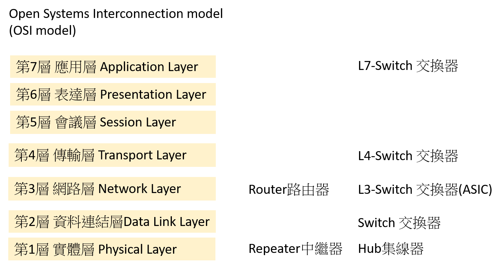

# 網路設備Network Devices

## [router 路由器](https://zh.wikipedia.org/wiki/%E8%B7%AF%E7%94%B1%E5%99%A8)

- 路由器是屬於OSI`第三層`的產品，交換器是OSI第二層的產品
- 路由器就是連接兩個以上個別網路(段)的裝置 ==>  左網段(192.168.1.0/24)---路由器---右網段(192.165.8.0/24)
## [cisco 路由器](https://www.cisco.com/c/en/us/products/routers/900-series-integrated-services-routers-isr/index.html)

## [L7 Switch交換器](https://home.gamer.com.tw/creationDetail.php?sn=4247878)

- 用於應用層中，提供網路應用服務，包含DHCP或瀏覽器(www、http)等，可做Cookie Switch、Session Switch、Url Switch 或是 CDN
## [L4 Switch交換器](https://home.gamer.com.tw/creationDetail.php?sn=4247878)

- 用於傳輸層中，可辨識傳輸層內TCP或UDP埠號，判斷封包是使用哪一種應用協定(http或ftp等)，在傳遞的封包中加入控制信息，以增加服務品質，達成重新導向(redirect)或伺服器的負載平衡(Load Balancing)
## [L3 Switch交換器](https://home.gamer.com.tw/creationDetail.php?sn=4247878)

- 運用在網路層，在傳輸中將IP位址加入資料組成封包，L3主要以IP運作為主，相比於L2 可橫跨不同實體區域或VLAN的IP路由，在不同網段間互相連通。
## [Hub集線器](https://www.tp-link.com/tw/blog/119/%E4%BA%A4%E6%8F%9B%E5%99%A8%E6%98%AF%E4%BB%80%E9%BA%BC-3%E7%A8%AE%E5%B8%B8%E8%A6%8B%E7%9A%84%E4%BA%A4%E6%8F%9B%E5%99%A8%E6%8E%A5%E6%B3%95-%E6%87%89%E7%94%A8%E5%A0%B4%E6%99%AF%E5%8F%8A%E5%8A%9F%E8%83%BD%E4%BB%8B%E7%B4%B9/)

- 集線器網關是將乙太網路或光纖集合在一起的裝置，與其讓連結的裝置在同一個網段工作，運作時具有廣播及半雙工2個特性。
## [Switch交換器](https://home.gamer.com.tw/creationDetail.php?sn=4247878)

- 在L2資料鏈結層，屬於全雙工，有一個表(Table)可以學習、儲存紀錄每台電腦的MAC位址，每個port是獨立的，並且分割碰撞網域可視為是 硬體 + ROM (table)。
## [Repeater](https://zh.wikipedia.org/zh-tw/%E4%B8%AD%E7%BB%A7%E5%99%A8)

- 一個將輸入訊號增強放大的類比裝置，而不考慮輸入訊號種類。一個將輸入訊號增強放大的類比裝置，而不考慮輸入訊號種類
